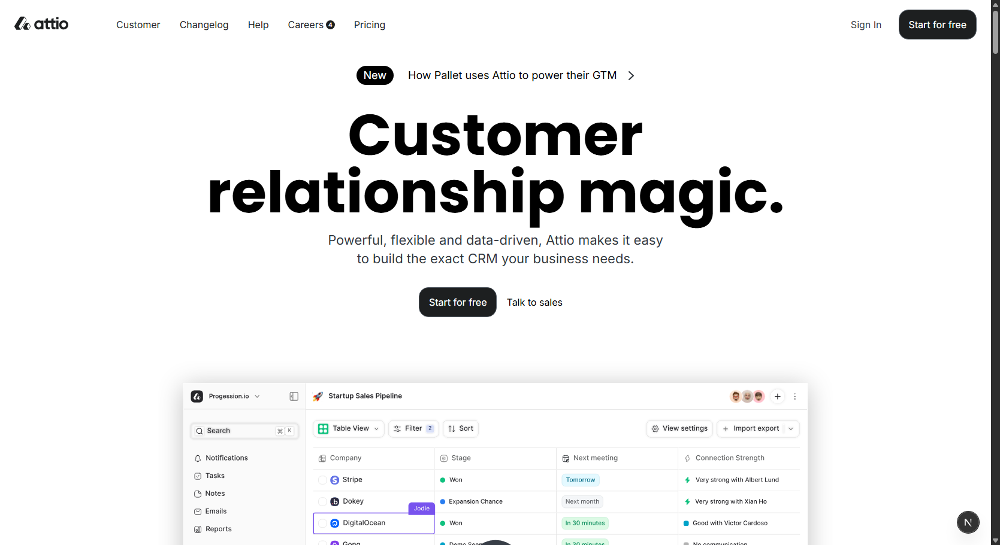

# Attio Landing Page Clone

A modern, fully responsive landing page inspired by Attio, built using **Next.js** and **Tailwind CSS**.

## Overview

This project is a front-end recreation of the Attio landing page, focused on translating a real-world SaaS design into clean, maintainable code.

The goal of this project was to:

* Practice converting a professional UI design into code
* Build reusable and scalable React components
* Improve responsiveness and layout precision
* Ship a polished, production-ready landing page

## Tech Stack

* **Next.js**
* **React**
* **Tailwind CSS**
* **TypeScript**

## Features

* Fully responsive design (mobile, desktop)
* Clean and modern UI inspired by a real SaaS product
* Component-based architecture
* Optimized layout and spacing
* Smooth UI interactions and transitions

## What I Learned

* Breaking down complex landing pages into reusable components
* Structuring layouts using Tailwind CSS
* Improving UI consistency and spacing
* Handling responsive design across multiple screen sizes
* Refining small UI/UX details for a polished feel

## Getting Started

Clone the repository:

```bash
git clone https://github.com/MrMM7/attio-landing-page.git
```

Install dependencies:

```bash
npm install
```

Run the development server:

```bash
npm run dev
```
## Site Preview



## Live Demo

https://attio-landing-page-nine.vercel.app/

## Credits

Websites Design inspired by [Attio](https://attio.com).
The figma design [file](https://www.figma.com/community/file/1372809934791054236)

## Author

**MrMM7**

Frontend developer focused on building modern, responsive web interfaces.

---

If you like this project, consider giving it a star!
